### `francisco@github:~$ whoami`

**Infraestrutura de TI · Automação · Observabilidade**

[**Conheça meu portfólio →**](https://franciscoafcj.github.io/Portf-lio/)

### `$ cat sobre-mim.md`

Sou **Francisco Junior**, Técnico de Infraestrutura de TI e estudante de **Engenharia de Software na UniFatecie**. Trabalho com sustentação de ambientes Windows e Linux, automação de rotinas e monitoramento de serviços.

Conecto essa experiência a projetos de **Cloud e DevOps**: infraestrutura como código, contêineres e entrega contínua. Gosto de transformar problemas operacionais em soluções documentadas e reutilizáveis.

### `$ ls projetos-em-destaque/`

| Projeto | O que você encontra | Tecnologias |
| :--- | :--- | :--- |
| [**Ambiente Azure com Terraform**](https://github.com/Franciscoafcj/terraform-azure-dev-environment) | Provisionamento modular de VM Linux e recursos de rede para desenvolvimento. | Terraform · Azure · Docker |
| [**AD Lockout Monitor**](https://github.com/Franciscoafcj/AD-Monitor-Blocked-Users) | Monitoramento de bloqueios de contas, identificação de origem e diagnóstico. | PowerShell · AD · WinRM |
| [**Laboratório Kubernetes**](https://github.com/Franciscoafcj/PROJETO-kubernetes-1) | Cluster K3s com aplicação PHP, MySQL persistente e registro de troubleshooting. | Kubernetes · Vagrant · Zabbix |
| [**AD User Creator**](https://github.com/Franciscoafcj/ad-user-creator-main) | Interface web integrada à automação do provisionamento de usuários. | PowerShell · AD · API REST |

### `$ cat experiencia.txt`

- **Automação:** PowerShell e Microsoft Graph para contas, grupos e licenças.
- **Observabilidade:** Grafana, Zabbix e SQL para disponibilidade, SLAs e investigação de incidentes.
- **Infraestrutura:** Windows Server, Linux, Active Directory, DNS/DNSSEC e serviços web.
- **Continuidade:** testes de recuperação e restauração de bancos SQL Server com Veeam.
- **Conhecimento compartilhado:** procedimentos operacionais e documentação de causas e soluções.

### `$ cat stack.conf`

| Área | Experiência e ferramentas |
| :--- | :--- |
| **Sistemas e identidade** | Linux, Windows Server, Active Directory, Microsoft Entra ID e Microsoft 365 |
| **Automação** | PowerShell, Bash e Microsoft Graph API |
| **Monitoramento e operação** | Grafana, Zabbix, Jira, gestão de incidentes e documentação técnica |
| **Redes e serviços** | TCP/IP, DNS/DNSSEC, DHCP, VLANs, UniFi, Apache, Nginx e SSL/TLS |
| **Dados e continuidade** | SQL, MySQL, PostgreSQL, Veeam e testes de recuperação |
| **Virtualização** | Proxmox VE e administração de máquinas virtuais |
| **Cloud, IaC e contêineres** | Vivência com AWS; projetos e laboratórios com Azure, Terraform, Docker, Docker Compose e Kubernetes/K3s |
| **Versionamento e CI/CD** | Git, GitHub e projetos com GitHub Actions e GitLab CI |

### `$ ./contribuicoes`

  

Minhas contribuições reais no GitHub, atualizadas diariamente. Animação de entrada com brilho nos dias de atividade.

### `$ cat proximo-passo.txt`

🎓 **Engenharia de Software — UniFatecie**, em andamento. Formação complementar em DevOps com AWS, fundamentos de arquitetura em nuvem e Docker.

Continuo aprofundando Linux, infraestrutura como código e observabilidade. Tenho interesse em oportunidades e colaboração em **Infraestrutura, SysAdmin, Cloud e DevOps**.

[**Explore minha trajetória e meus projetos no portfólio →**](https://franciscoafcj.github.io/Portf-lio/)

---

Visual inspirado no <a href="https://www.avivashishta.com/blog/build-animated-github-profile-readme">tutorial de Avi Vashishta</a>. Arte e conteúdo adaptados para este perfil. Retrato e calendário são atualizados pelo GitHub Actions; o cartão de apresentação é gerado com <code>node scripts/generate-profile.mjs</code>.
